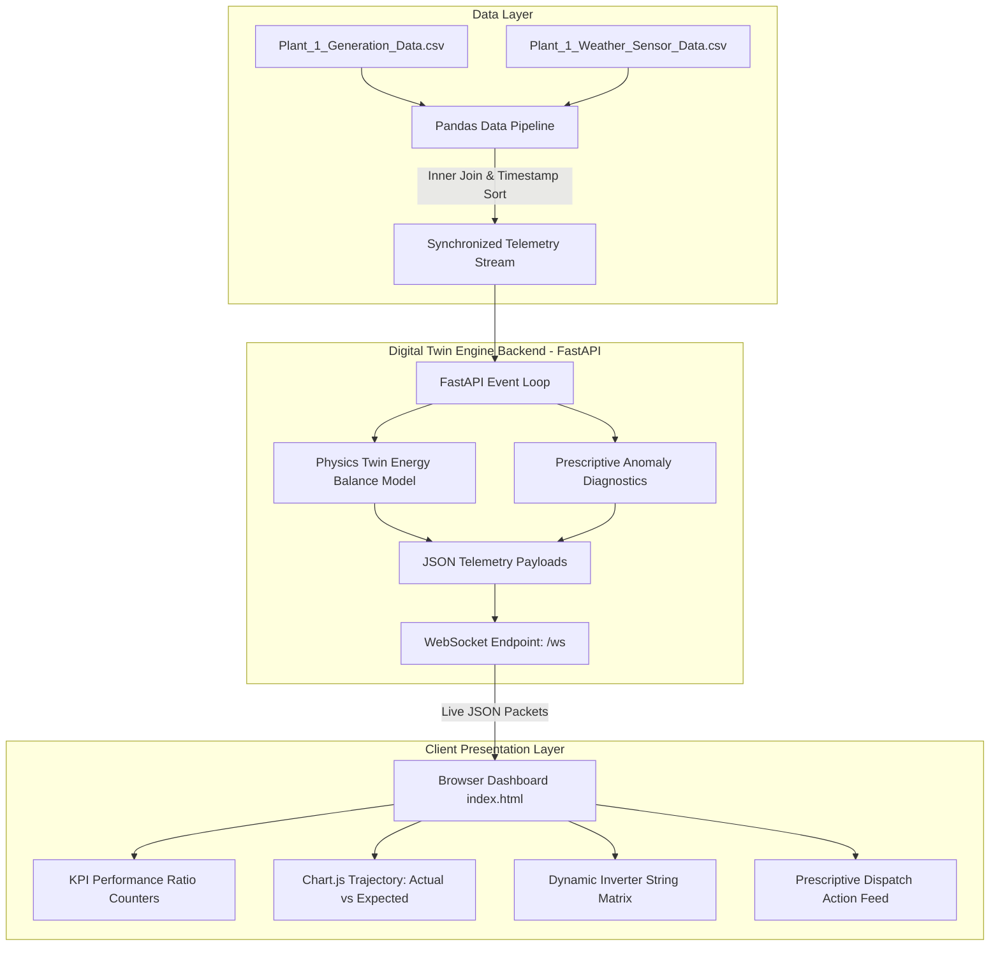

# ☀️ Solar Plant Digital Twin & Real-Time Predictive Maintenance

[](https://www.python.org/)
[](https://fastapi.tiangolo.com/)
[](https://developer.mozilla.org/en-US/docs/Web/API/WebSockets_API)
[](https://www.chartjs.org/)
[](https://tailwindcss.com/)
[](https://www.kaggle.com/datasets/anikannal/solar-power-generation-data)

An end-to-end physics-based **Digital Twin** and industrial monitoring dashboard for commercial photovoltaic (PV) solar plants. The system streams multi-inverter sensor and meteorological telemetry over high-throughput WebSockets, computes physical energy balance models in real time, and provides automated prescriptive fault diagnosis and maintenance dispatch alerts.

---

## 📌 Table of Contents

- [Overview](#-overview)
- [Key Features](#-key-features)
- [Dataset Architecture (Kaggle)](#-dataset-architecture-kaggle)
- [Digital Twin Physics & Diagnostic Engine](#-digital-twin-physics--diagnostic-engine)
- [System Architecture](#-system-architecture)
- [Project Directory Structure](#-project-directory-structure)
- [Getting Started](#-getting-started)
- [Dashboard Walkthrough](#-dashboard-walkthrough)
- [Future Enhancements](#-future-enhancements)
- [License & Acknowledgments](#-license--acknowledgments)

---

## 🔬 Overview

In commercial solar power installations, underperforming equipment often remains undetected until significant revenue is lost. This project bridges physical photovoltaic equations with real-time operational software to create an active **Digital Twin** of **Plant 1 (ID: 4135001)**:

1. **Simulated Telemetry Feed**: Ingests historical 15-minute plant telemetry from Kaggle and streams it interval-by-interval using asynchronous WebSockets.
2. **Mathematical Energy Modeling**: Calculates expected DC power for each inverter based on ambient solar irradiance ($G$) and silicon module temperature ($T_{\text{module}}$) using PV degradation coefficients.
3. **Automated Anomaly Detection**: Discrepancies between physical generation and expected twin output trigger categorized root-cause diagnostic states (soiling, shading, inverter breaker trips).
4. **Interactive Dashboard**: A responsive dark-mode operator console with dynamic line charts, system Performance Ratio (PR %), and individual inverter string health cards.

---

## ✨ Key Features

- **⚡ Asynchronous Live Telemetry Stream**: Built with FastAPI WebSockets delivering full-plant synchronized snapshots at 1-second ticks (representing 15-minute operational steps).
- **🧮 Physics-Informed Digital Twin**: Calculates dynamic baseline yields using standard photovoltaic temperature coefficients ($\gamma = -0.4\% / ^\circ\text{C}$).
- **🛠️ Automated Prescriptive Maintenance**: Categorizes plant anomalies into:
  - `NORMAL`: Peak yield ($PR \ge 85\%$).
  - `WARNING`: Soiling/dust accumulation ($60\% \le PR < 85\%$) $\rightarrow$ *Schedules cleaning*.
  - `FAULT`: Hotspot / physical string shading ($PR < 60\%$) $\rightarrow$ *Inspects physical obstructions*.
  - `CRITICAL FAULT`: Inverter breaker trip / electrical disconnect $\rightarrow$ *Immediate dispatch order*.
- **📊 Real-Time Dynamic Visualization**: Chart.js graphs tracking **Actual Generation vs. Twin Expected Generation** over rolling operational windows.
- **📱 Clean Modern UI**: High-contrast, responsive industrial control layout styled with Tailwind CSS.

---

## 📊 Dataset Architecture (Kaggle)

The data used in this project is sourced from the benchmark **[Solar Power Generation Data](https://www.kaggle.com/datasets/anikannal/solar-power-generation-data)** dataset on Kaggle, collected at a solar power plant in India over a 34-day period.

### 1. Power Generation Data (`Plant_1_Generation_Data.csv`)
Logs electrical metrics across 22 sub-array inverter units at 15-minute intervals:
| Column Name | Description |
| :--- | :--- |
| `DATE_TIME` | Timestamp of measurement (`DD-MM-YYYY HH:MM`) |
| `PLANT_ID` | Unique plant identifier (`4135001`) |
| `SOURCE_KEY` | Inverter sensor ID (22 unique strings) |
| `DC_POWER` | Direct current output power (kW) |
| `AC_POWER` | Alternating current grid feed (kW) |
| `DAILY_YIELD` | Cumulative energy generated for the current day (kWh) |
| `TOTAL_YIELD` | Cumulative lifetime energy generated by the inverter (kWh) |

### 2. Weather Sensor Data (`Plant_1_Weather_Sensor_Data.csv`)
Logs meteorological parameters collected by an onsite weather monitoring station:
| Column Name | Description |
| :--- | :--- |
| `DATE_TIME` | Timestamp of measurement (`YYYY-MM-DD HH:MM:SS`) |
| `PLANT_ID` | Unique plant identifier (`4135001`) |
| `SOURCE_KEY` | Weather station sensor identifier |
| `AMBIENT_TEMPERATURE` | Air temperature surrounding panels ($^\circ\text{C}$) |
| `MODULE_TEMPERATURE` | Surface temperature of the PV modules ($^\circ\text{C}$) |
| `IRRADIATION` | Solar irradiance incident on the panel surface ($\text{kW/m}^2$) |

> **Note**: In `backend.py`, timestamps are parsed, unified, and inner-joined on `[DATE_TIME, PLANT_ID]` to provide synchronized weather and multi-inverter telemetry vectors.

---

## 📐 Digital Twin Physics & Diagnostic Engine

### 1. Energy Balance Model
The theoretical expected power output $P_{\text{expected}}$ is modeled using the empirical photovoltaic irradiance-temperature response equation:

$$P_{\text{expected}} = P_{\text{DC, rating}} \times G \times \left[ 1 + \gamma \cdot (T_{\text{module}} - T_{\text{STC}}) \right]$$

Where:
- $P_{\text{DC, rating}} = 650\text{ kW}$ (Nominal peak inverter DC capacity)
- $G$ = Incident solar irradiation ($\text{kW/m}^2$)
- $\gamma = -0.004\text{ } /^\circ\text{C}$ (Temperature coefficient for crystalline silicon: $-0.4\% / ^\circ\text{C}$)
- $T_{\text{module}}$ = PV surface temperature ($^\circ\text{C}$)
- $T_{\text{STC}} = 25.0^\circ\text{C}$ (Standard Test Condition reference temperature)

### 2. Anomaly Classification Decision Matrix

```
                      [Is Irradiation < 0.05 kW/m²?]
                                  |
                   +--------------+--------------+
                   | YES                         | NO
                   v                             v
               [IDLE]             [Expected > 50 kW & Actual < 5 kW?]
         (Night / Low Sunlight)                  |
                                  +--------------+--------------+
                                  | YES                         | NO
                                  v                             v
                              [FAULT]                    Ratio = Actual / Expected
                       (Inverter Tripped)                       |
                                         +----------------------+----------------------+
                                         | Ratio >= 0.85        | 0.60 <= Ratio < 0.85 | Ratio < 0.60
                                         v                      v                      v
                                      [NORMAL]              [WARNING]               [FAULT]
                                     (Optimal)           (Soiling/Dust)         (Severe Shading)
```

---

## 🏗️ System Architecture



---

## 📂 Project Directory Structure

```plaintext
solar_digital_twin/
├── Plant_1_Generation_Data.csv      # Kaggle PV Generation Telemetry (22 inverters)
├── Plant_1_Weather_Sensor_Data.csv  # Kaggle Onsite Meteorological Station Data
├── backend.py                       # FastAPI server, WebSocket emitter & Twin model
├── index.html                       # Operator dashboard UI (Tailwind CSS + Chart.js)
└── README.md                        # Documentation and architecture guide
```

---

## 🚀 Getting Started

### Prerequisites
- Python 3.8 or later
- Modern web browser (Chrome, Firefox, Edge, Safari)

### 1. Clone the Repository
```bash
git clone https://github.com/Apserty/Solar-PV-Digital-Twin-Simulation.git
cd Solar-PV-Digital-Twin-Simulation
```

### 2. Download the Datasets
Ensure `Plant_1_Generation_Data.csv` and `Plant_1_Weather_Sensor_Data.csv` are placed in the root directory. If downloading directly from Kaggle:
1. Visit the [Solar Power Generation Data Dataset](https://www.kaggle.com/datasets/anikannal/solar-power-generation-data).
2. Download and unzip the CSV files into the project folder.

### 3. Install Python Dependencies
```bash
pip install fastapi uvicorn pandas websockets
```

*(Optional) Create a `requirements.txt`:*
```bash
pip freeze > requirements.txt
```

### 4. Start the Application Server
Run the FastAPI backend using `uvicorn`:
```bash
uvicorn backend:app --reload --host 127.0.0.1 --port 8000
```

### 5. Access the Dashboard
Open your web browser and navigate to:
```
http://127.0.0.1:8000
```
The operator dashboard will automatically establish a WebSocket link (`ws://127.0.0.1:8000/ws`) and begin streaming real-time simulation cycles.

---

## 🖥️ Dashboard Walkthrough

| Section | Function |
| :--- | :--- |
| **Telemetry Banner** | Displays live connection status, simulation timestamp, ambient temperature, and current solar irradiance. |
| **Plant KPI Cards** | High-level overview of aggregate Actual Power (kW), Twin Expected Power (kW), Plant PR (%), and Active Inverter Fault Count. |
| **Generation Trajectory** | Smooth dual-line chart comparing plant generation in real time against the theoretical physical twin baseline. |
| **Prescriptive Action Feed** | Actionable, prioritized maintenance dispatch orders generated automatically based on fault diagnosis. |
| **Inverter String Matrix** | 22 individual inverter telemetry cards displaying real-time actual vs. expected kW, cell temperature, and status badges (`NORMAL`, `WARNING`, `FAULT`). |

---

## 🔮 Future Enhancements

- [ ] **Machine Learning Soiling Prediction**: Train an XGBoost / LSTM model to predict optimal washing cycles before PR drops below $80\%$.
- [ ] **Dual-Plant Comparison**: Extend the ingestion pipeline to support `Plant 2` from the Kaggle dataset for cross-site performance benchmarking.
- [ ] **Automated Work Orders**: Integration with webhook dispatch systems (Slack / PagerDuty / Email) for automated technician notifications.
- [ ] **Docker Deployment**: Add a `Dockerfile` and `docker-compose.yml` for containerized single-command execution.

---

## 📜 License & Acknowledgments

- **Dataset**: Provided by [Anik Rahman on Kaggle](https://www.kaggle.com/datasets/anikannal/solar-power-generation-data) under Open Data Commons Public Domain Dedication and License (ODC-By).
- **Core Stack**: [FastAPI](https://fastapi.tiangolo.com/), [Pandas](https://pandas.pydata.org/), [Chart.js](https://www.chartjs.org/), and [Tailwind CSS](https://tailwindcss.com/).
